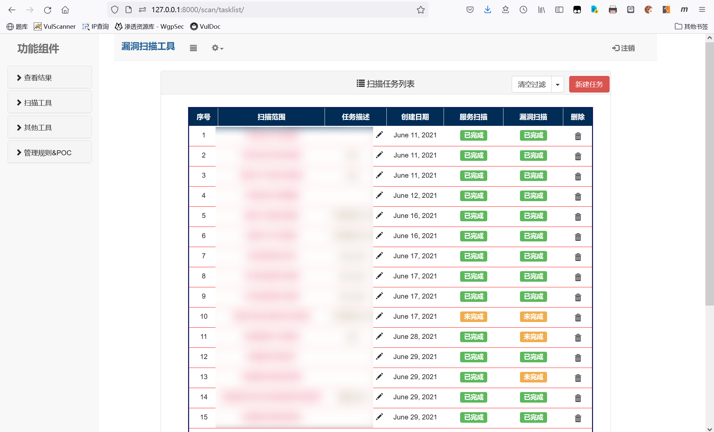

# VulScanner


> 一款适合渗透测试中随时记录和保存的漏洞检测工具


#### 0x00 主要模块

* 任务列表（扫描/FOFA采集/IP段采集）

* POC列表

* 服务扫描

* 漏洞扫描

* FOFA结果采集

* IP段采集

****

#### 0x01 任务列表

> 示例





**实现功能：**

1. 可视化服务扫描结果，对于扫描进度实时显示，点击“服务扫描”或“漏洞扫描”进度标签可查看扫描结果


**使用说明**

1. 可点击“笔”图标对任务描述进行即时修改，方便任务管理

2. 可根据ip范围和扫描进度对结果进行过滤：


3. 点击“新建任务”，可创建服务扫描或漏洞扫描任务


4. 对于FOFA采集与IP段采集等结果也采取可视化列表形式查看：


****

#### 0x02 POC列表

> 示例


**实现功能：**

1. 工具内置34种常见且危害性较高的漏洞检测模块，可点击启用图标设置该模块是否启用，并可一键启/禁用，方便调试

2. 可根据类型查看相应POC，方便信息整理


**使用说明：**

1. 添加POC时根据漏洞相应信息填写各栏：


如该漏洞可实现方便的exp攻击，可同时选择exp类型：


并可在后续的漏洞扫描中根据不同类型的exp进行调用

2.提交poc名称后，module目录下会自动生成 ‘poc名称_poc.py’，如具有exp，将同时生成‘poc名称_exp.py’，漏洞检测时会根据poc名称进行反射调用，故请勿修改文件名：


poc和exp脚本初始化为模板文件，并对requests和文件操作函数进行封装，可根据具体验证方法修改文件，大致逻辑如下：

```

poc.py:

    def fingerprint(service):   #进行漏洞检测前首先进行指纹识别，如满足指纹则继续验证

        if (指纹识别):

            return True #如指纹识别结果需保存，可返回Str并保存至service.speciality

        else:

            return False


    def poc(service):   进行漏洞检测

        if (存在漏洞):

            return ['漏洞名（自动生成）',  '具体情况', ('漏洞等级（可选）')] #如漏洞检测需返回特殊结果，可用元组形式返回：（[与前一致], '特殊结果'），其中特殊结果保存至vuln.specify


exp.py:

    def exp(vuln):

        return "命令执行结果"


```


**具体模块：**

* **弱密码类型：**

1. 数据库弱密码：

	*  包含mysql、mssql、redis、postgresql数据库弱密码检测功能

	*  示例：


2. tomcat弱密码：

	*  采用metasploit内置tomcat弱密码字典，注意tomcat自带密码保护机制，大量爆破可能导致manager用户被禁用

	*  爆破成功后可执行exp，自动部署webshell目录下zs.war包并可执行命令

	*  示例：


3. axis2弱密码：

	*  自动探测axis2目录，如存在axis2-admin目录则尝试以admin/axis2登录

	*  登陆成功后可执行exp，自动部署webshell下aar包并可执行命令

	*  示例：


4. weblogic控制台弱密码：

	*  自动探测是否开放console路径，并尝试爆破，爆破成功则返回用户名/密码

	*  示例：


5. Zyxel 硬编码后门账户：

	*  尝试以zyfwp/PrOw!aN_fXp登录ftp端口，如登陆成功则返回漏洞结果

	*  示例：


6. ~~daloradius弱密码（0day）~~：
*  ~~尝试以默认密码登录~~

*  ~~登陆成功可执行exp，可上传文件至网站根目录~~

*  ~~示例：~~

7. 部分安全设备密码泄露：

	*  对中科网威等安全设备前端泄露密码进行探测并返回结果

	*  示例：


8. ssh弱密码：

	*  对22端口进行爆破登录

	*  如爆破成功则可使用命令执行exp：

	*  示例：


* **命令执行类型**

1. shiro反序列化：

	*  对常见key进行探测，支持cbc/gcm加密方式，采用SimplePrincipalCollection的payload，可不出网测试

	*  示例：


2. 浪潮管理系统V4.0 RCE：

	*  支持未授权登录/登录接口RCE/SysShel接口RCE漏洞检测

	*  如存在SysShell接口RCE漏洞，可使用命令执行exp：

	*  示例：


3. 用友OA BshServlet接口泄露：

	*  探测是否开放BshServlet接口

	*  如存在漏洞，则可使用命令执行exp

	*  示例：


4. docker未授权漏洞：

	*  探测是否可访问info路径

	*  示例：


5. Thinkphp debug命令执行：

	*  测试是否可调用debug模块执行代码

	*  如存在漏洞，则可使用命令执行exp

	*  示例：


6. Thinkphp5命令执行：

	*  测试是否可调用index/think/app/invokefunction模块执行代码

	*  如存在漏洞，则可使用命令执行exp

	*  示例：


7. weblogic_XML反序列化：

	*  上传文件测试是否存在XML反序列化漏洞

	*  如存在漏洞，则可使用文件上传exp

	*  示例：


8. weblogic_wls9-async反序列化：

	*  利用@lufei大佬的poc测试，如有命令回显则存在漏洞

	*  如存在漏洞，则可使用命令执行exp

	*  示例：


9. MS17_010：

	*  不多说了

10. Apache Solr Velocity模板远程执行：

	*  首先未授权获取目标全部core，再以此测试是否可修改params.resource.loader.enabled值，如可修改，则返回并保存，以供exp使用

	*  如存在漏洞，可使用命令执行exp

	*  示例：


11. 泛微OA_XML反序列化：

	*  采用URLDNS模块测试

	*  目前大部分系统均已修复，且进一步利用条件较为困难，故不提供exp

12. 奇安信 网康下一代防火墙RCE：

	*  通过写入命令至文件方式利用，如写入成功，则存在漏洞

	*  如存在漏洞，可使用命令执行exp

	*  示例：


13. H3C SecParh堡垒机远程命令执行：

	*  首先通过未授权获取管理员权限，再代码注入执行命令

	*  如存在漏洞，则可使用命令执行exp

	*  示例：


* **任意文件上传类型**

1. 泛微OA9.0 任意文件上传：

	*  存在漏洞路径为/page/exportImport/uploadOperation.jsp

	*  由于目前大部分系统已修复，故不提供exp

2. ShowDoc 任意文件上传：

	*  存在漏洞路径为/index.php?s=/home/page/uploadImg

	*  如存在漏洞，则可使用文件上传exp：


3. 和信创天云桌面_RCE：

	*  漏洞路径：/Upload/upload_file.php

	*  如存在漏洞，则可使用文件上传exp

	*  示例：


* **SQL注入类型**

1. 360天擎 前台SQL注入：

	*  漏洞路径：/api/dp/rptsvcsyncpoint?ccid=1，采用堆叠注入延时验证

	*  示例：


2. 泛微OA8.0 前台SQL注入：

	*  漏洞路径：/js/hrm/getdata.jsp?cmd=getSelectAllId&sql={payload}

	*  示例：


* **SSRF类型**

1. MinIO SSRF：

	*  漏洞路径：/minio/webrpc，通过修改Host头可造成SSRF，结合docker未授权等可实现RCE

	*  示例：


	* *任意文件读取类型**

1. 蓝凌OA 任意文件读取：

	*  漏洞路径：/sys/ui/extend/varkind/custom.jsp，如成功读取则对管理员密码解密

	*  如存在漏洞，则可使用文件读取exp

	*  示例：


2. 致远OA_webmail.do任意文件下载：

	*  漏洞路径：/seeyon/webmail.do?method=doDownloadAtt&filename=test.txt&filePath={payload}，测试读取datasourceCtp.properties文件

	*  如存在漏洞，则可使用文件读取exp

	*  示例：


3. Apache Solr 任意文件读取：

	*  漏洞路径：/solr/{core}/debug/dump?param=ContentStreams&stream.url=file:///{payload}，先通过未授权获取有效core，再尝试读取/etc/passwd进行验证

	*  如存在漏洞，则可使用文件读取exp

	*  示例：


4. 帆软报表V8.0 任意文件读取

	*  漏洞路径：/WebReport/ReportServer?op=chart&cmd=get_geo_json&resourcepath={payload}，尝试读取privilege.xml，如读取成功，自动解密并返回管理员用户名和密码

	*  如存在漏洞，则可使用文件读取exp

	*  示例：


5. Apache Flink 任意文件读取：

	*  漏洞路径：/jobmanager/logs/..%252f......%252f/{payload}，尝试读取etc/passwd，如成功读取则返回漏洞结果

	*  如存在漏洞，则可使用文件读取exp

	*  示例：


* **垂直越权漏洞**

1. weblogic_控制台未授权访问：

	*  尝试访问/console/css/%252e%252e%252fconsole.portal，如可成功访问则返回漏洞结果

	*  示例：


2. JumpServer 日志接口未授权：

	*  漏洞路径：/ws/ops/tasks/log/，尝试进行websocket通信并获取操作日志，如可成功读取则返回首段日志

	*  示例：


****

#### 0x03 服务扫描

> 示例：


**实现功能：**

1. 扫描IP段内全部主机端口开放情况，可视化开放端口及web服务情况

2. 对已测试IP可随时备注，及时显示漏洞信息

3. 对扫描完成数据以表格形式导出，方便结果总结


**使用说明：**


1. 扫描IP范围支持段方式与范围方式，如：

    1）127.0.0.1/24

    2）127.0.0.1-127.0.0.225

    3）127.0.0.1/24;127.0.2.0/24

   等，多段地址间用“;”分割

2. 扫描端口暂时分为四种：常用端口，精简端口，全端口与其他端口：


选择其他端口后可在新输入框中输入扫描端口，以“,”分割：


3. 开始扫描后前端以jquey异步请求已扫描完成数据，并根据扫描进度控制进度条，扫描时状态：


扫描结束状态：


4. 对于开放web服务的端口，会显示服务标签，鼠标悬停时可查看网页的标题，服务器等信息：


点击则会打开新窗口跳转至该网页


5. 对于已测试ip可点击状态图标修改备注：


漏洞扫描完成后也会对存在漏洞ip进行自动标记：


6. 服务扫描完成后可点击”扫描漏洞“对本次扫描任务下的全部ip进行漏洞扫描


7. 点击“导出表格”按钮可以csv文件形式导出本次扫描任务数据：


****

#### 0x04 漏洞扫描：

> 示例


**实现功能：**

1. 暂时集成34种常用漏洞检测模块，实行指纹检测+POC+exp，提高检测效率和准确性

2. 对扫描完成数据以表格形式导出，方便结果总结

3. 对于命令执行或文件上传等漏洞，整合exp，实现测试攻击一体化


**使用说明：**

1. 漏洞扫描所使用模块可在POC列表中进行更改，也可指定类型POC进行扫描


2. 如直接在该页面下扫描ip段则会先进行常用端口的服务扫描：


服务扫描结束后才会进行漏洞扫描：


服务扫描结果也同样会保存于任务列表中


****

#### 0x05 FOFA采集：

> 示例：


**实现功能：**

1. 利用fofa接口查询前100条数据，并自动访问开放的web端口，可视化服务列表

2. 可将查询数据以表格形式导出，方便结果分析


**使用说明：**

1. 点击“查看查询语法”可查看常用查询语句：


2. 查询时如不指定country，则自动添加查询语句：’country="CN" && region != "HK"‘


****

#### 0x06 IP段采集：

> 示例：


**实现功能：**

1. 通过<https://ip.bmcx.com/>查询接口，通过地理位置获取IP段

2. 可将查询数据以表格形式导出，方便结果分析


**使用说明：**

1. 对查询出的结果可点击“扫描服务”对该IP段进行服务扫描，描述自动保存为具体定位的第二部分


****

#### 0x07 配置与使用

1. 下载后请修改config.ini文件的数据库配置，仅支持mysql数据库：

   

2. 登录mysql数据库创建名为scan的数据库

3. 命令行安装所需第三方库：```pip install -r requirements.txt```

4. django初始化配置：

   `python manage.py makemigrations`

   `python manage.py migrate`

 5. 配置初始poc：

    `python install.py`

    

6. 启动django服务器:

   `python manage.py runserver`

   

7. 访问<http://127.0.0.1:8000/>:

   

